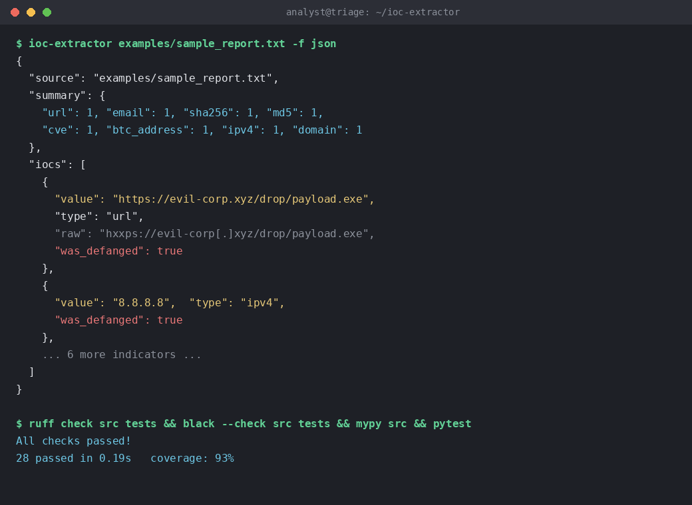

# IOC Extractor

[](https://github.com/yourname/ioc-extractor/actions/workflows/ci.yml)
[](LICENSE)
[](pyproject.toml)

Extract, validate, defang-aware normalize, and export **Indicators of
Compromise (IOCs)** from unstructured text — threat reports, phishing
emails, pastes, log excerpts — into JSON, CSV, or a lightweight STIX 2.1
bundle for downstream SIEM/TIP ingestion.

This is a **defensive, read-only** analysis tool. It never fetches URLs,
executes payloads, or performs any network action — it only parses text
you give it.



## Why this exists

Analysts constantly copy-paste IOCs out of PDF reports and vendor blogs by
hand. This tool automates that first triage step: find every candidate
indicator, refang it back to a canonical form, validate it isn't a false
positive (version strings, non-routable IPs, malformed CVE IDs), dedupe,
and hand you structured output ready for a blocklist or TIP import.

## Supported indicator types

| Type | Example |
|---|---|
| IPv4 / IPv6 | `8.8.8.8`, defanged `8[.]8[.]8[.]8` |
| Domain | `evil-corp.xyz` |
| URL | `hxxps://evil-corp[.]xyz/drop/payload.exe` |
| Email | `attacker[at]protonmail[.]com` |
| MD5 / SHA1 / SHA256 / SHA512 | file hashes |
| CVE | `CVE-2023-4863` |
| Bitcoin address | `1A1zP1eP5QGefi2DMPTfTL5SLmv7DivfNa` |
| File path | Windows and POSIX paths |

## Install

```bash
pip install ioc-extractor
```

Or from source:

```bash
git clone https://github.com/yourname/ioc-extractor.git
cd ioc-extractor
pip install -e ".[dev]"
```

## Usage

### CLI

```bash
# Scan a file, print JSON to stdout
ioc-extractor examples/sample_report.txt

# Output CSV to a file
ioc-extractor report.txt -f csv -o iocs.csv

# Output a STIX 2.1 bundle
ioc-extractor report.txt -f stix

# Read from stdin
cat report.txt | ioc-extractor
```

### As a library

```python
from ioc_extractor import extract

result = extract(open("report.txt").read())
print(result.summary())          # {'ipv4': 3, 'domain': 5, ...}
print(result.by_type("domain"))  # list of IOC objects
```

See [`examples/extract_example.py`](examples/extract_example.py) for a
full walkthrough against [`examples/sample_report.txt`](examples/sample_report.txt).

### Docker

```bash
docker build -t ioc-extractor .
cat report.txt | docker run -i ioc-extractor
```

## Architecture

See [`docs/architecture.md`](docs/architecture.md) for the full design
document. In short: `core` (pure domain logic) → `io` (file/stdin readers,
JSON/CSV/STIX writers) → `cli` (composition root). The core has zero
dependencies and zero I/O, which is what makes it exhaustively unit
testable.

```
src/ioc_extractor/
├── core/
│   ├── models.py       # IOC, IOCType, ExtractionResult
│   ├── patterns.py      # regex registry per IOC type
│   ├── defanging.py     # detect + reverse analyst defanging notation
│   ├── validators.py     # false-positive filtering
│   └── extractor.py     # orchestration: match → refang → validate → dedupe
├── io/
│   ├── readers.py       # file / stdin adapters
│   └── writers.py       # JSON / CSV / STIX-lite adapters
└── cli.py                # argparse entry point (composition root)
```

## Development

```bash
pip install -e ".[dev]"
pre-commit install

ruff check src tests
black --check src tests
mypy src
pytest
```

## Contributing

See [CONTRIBUTING.md](CONTRIBUTING.md).

## Security

See [SECURITY.md](SECURITY.md) for how to report vulnerabilities.

## Known limitations

- **Bitcoin addresses are not Base58Check checksum-validated.** The
  `btc_address` pattern matches the correct character set and length range,
  but does not verify the checksum, so a well-formed-looking but invalid
  address can still be reported. Treat it as a candidate, not a confirmed
  wallet.
- **Files are processed fully in memory.** `extract()` takes the entire
  document as a single string; there is currently no streaming/chunked
  mode. This is fine for typical reports and log excerpts, but very large
  inputs (hundreds of MB+) should be split before scanning.
- **Logging is intentionally minimal.** This tool follows Unix pipeline
  conventions: stdout carries data, and there is no verbose/debug logging
  output by design, so it composes cleanly with `|`, `>`, and other CLI
  tooling without extraneous noise.

## Roadmap / future improvements

- [ ] Pluggable pattern packs (industry-specific IOC types)
- [ ] Confidence scoring per indicator (co-occurrence, context keywords)
- [ ] MISP event export format
- [ ] Async batch mode for scanning large report corpora
- [ ] Optional enrichment hooks (offline-only allow-list checks)

## License

MIT — see [LICENSE](LICENSE).
